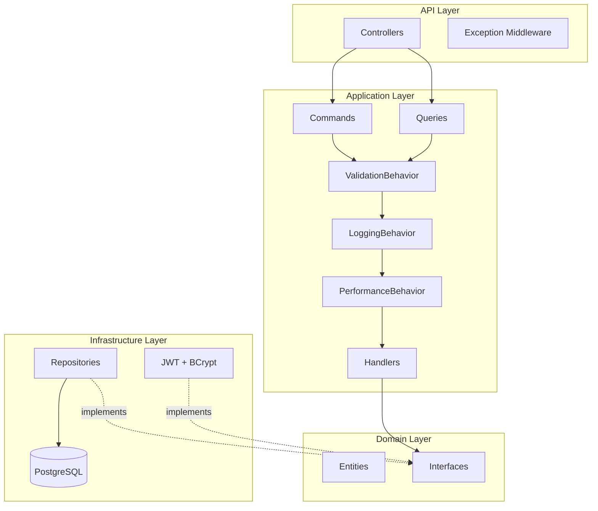

# SyncPodcast


A podcast syncing application built with **Clean Architecture**, **CQRS**, and **.NET 10** — a ground-up rewrite of a legacy WinForms/MongoDB app into a modern, testable, layered system.

## Overview

SyncPodcast lets users subscribe to podcasts, browse episodes, and track playback progress across sessions. The backend exposes a RESTful API with JWT authentication (including refresh token rotation), while the WPF desktop client provides a Spotify-inspired dark-mode interface.

This project started as a rewrite challenge: the original app was a monolithic WinForms application backed by MongoDB with tightly coupled data access and no separation of concerns. The rewrite targets .NET 10 with Clean Architecture, replacing MongoDB with PostgreSQL via EF Core, introducing CQRS through MediatR, and building a proper MVVM desktop client with dependency injection.

## Architecture



**Request flow:** HTTP Request → Controller → MediatR Command/Query → ValidationBehavior → LoggingBehavior → PerformanceBehavior → Handler → Repository → DTO → HTTP Response

## Tech Stack

| Layer | Technology |
|---|---|
| **Backend** | .NET 10, ASP.NET Core Web API |
| **CQRS** | MediatR 14 |
| **Validation** | FluentValidation 12 |
| **ORM** | EF Core 10 + Npgsql (PostgreSQL) |
| **Auth** | JWT Bearer + BCrypt.Net-Next, refresh token rotation |
| **Frontend** | .NET 10 WPF, CommunityToolkit.Mvvm 8.4, DI |
| **Testing** | xUnit 2.9, Coverlet |

## Key Features & Highlights

### MediatR Pipeline Behaviors

Every request passes through a chain of pipeline behaviors before reaching its handler — no manual wiring needed:

- **ValidationBehavior** — runs FluentValidation rules and short-circuits with structured errors
- **LoggingBehavior** — logs every incoming request with structured metadata
- **PerformanceBehavior** — flags slow-running handlers with elapsed time warnings

This means cross-cutting concerns like validation and logging are completely decoupled from business logic.

### JWT Authentication with Refresh Tokens

Full token lifecycle implementation:

- **Issue** — login/register returns an access token + refresh token with independent expiry
- **Refresh** — clients exchange an expired access token + valid refresh token for a new pair
- **Rotate** — each refresh issues a new refresh token, invalidating the previous one
- **Revoke** — logout clears the refresh token server-side, preventing reuse

Access tokens are stateless (validated by signature); refresh tokens are stateful (stored on the User entity and validated against the database).

### Rich Domain Model

Domain entities encapsulate business rules rather than acting as plain data bags:

- `Podcast.AddEpisode()` rejects duplicate episodes by matching on feed GUID
- `PlaybackProgress.UpdatePosition()` auto-marks an episode as finished when progress exceeds 90%
- `User.SetRefreshToken()` / `ValidateRefreshToken()` / `ClearRefreshToken()` manage the full refresh token lifecycle
- All entities use private setters — state changes only happen through explicit behavior methods

## Project Structure

```
SyncPodcasts/
├── SyncPodcast.Domain/            # Entities, interfaces, exceptions (zero dependencies)
├── SyncPodcast.Application/       # CQRS commands, queries, handlers, validators, DTOs
├── SyncPodcast.Infrastructure/    # EF Core, repositories, JWT + BCrypt services
├── SyncPodcast.API/               # ASP.NET Core controllers, middleware, config
├── SyncPodcast.Domain.Tests/      # Domain entity unit tests
├── SyncPodcast.Application.Tests/ # Handler tests with mocked interfaces
├── SyncPodcast.Infrastructure.Tests/
├── SyncPodcast.API.Tests/         # Integration tests
└── SyncPodcasts.slnx              # .NET XML solution file

frontends/
└── SyncPodcast.WPF/               # WPF desktop client (MVVM + DI)
    ├── Views/                     # MainWindow + 5 UserControls + FullPlayerOverlay
    ├── ViewModels/                # ObservableObject VMs with RelayCommands
    ├── Services/                  # Navigation, player service abstractions
    ├── Controls/                  # NowPlayingBar custom control
    ├── Converters/                # Value converters (bool/null visibility, time formatting)
    └── Resources/                 # Dark theme brushes, typography, component styles
```

## Design Decisions

- **Clean Architecture** — domain and application layers have zero dependency on infrastructure, making business logic fully testable without databases or HTTP
- **CQRS via MediatR** — separating reads from writes keeps handlers focused; pipeline behaviors handle cross-cutting concerns without polluting business logic
- **Rich domain entities over anemic models** — pushing rules like duplicate detection and auto-finish thresholds into entities prevents scattered validation logic and makes invariants impossible to bypass
- **WPF with MVVM + DI** — desktop-first approach with proper separation; ViewModels are resolved from the DI container, navigation is service-based, and the UI is fully decoupled from data access

## Screenshots

> Screenshots coming soon .
